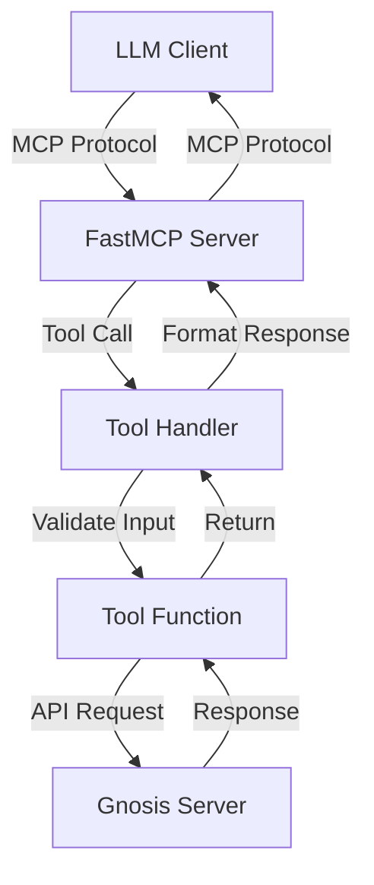

# MCP Server Command Architecture

## Overview

The `deepctl-cmd-mcp` package implements a Model Context Protocol (MCP) server that connects to Deepgram's Gnosis AI service using the official MCP Python SDK from Anthropic. This enables LLM clients (like Claude Desktop, VS Code, or custom applications) to interact with Deepgram's knowledge base through a standardized protocol.

## Known Limitations

### Signal Handling in STDIO Mode

When running the MCP server in STDIO mode (the default), the server may require pressing Ctrl+C twice to shut down. This is a known limitation of the FastMCP framework's signal handling in STDIO mode. The first Ctrl+C will display "MCP server stopped by user" but the process may continue running until a second interrupt is sent.

**Workarounds:**

- Press Ctrl+C twice to ensure the server stops
- Use a process manager or supervisor that can send SIGKILL if needed
- For automated deployments, consider using SSE or HTTP transport modes which handle signals more gracefully

## Architecture

### Component Structure

```
deepctl-cmd-mcp/
├── src/deepctl_cmd_mcp/
│   ├── __init__.py
│   ├── command.py      # Main command and MCP server setup
│   └── models.py       # Pydantic models for data validation
└── tests/
    └── unit/
        └── test_mcp_command.py
```

### Key Components

#### 1. McpCommand (BaseCommand)

- Entry point for the `deepctl mcp` command
- Handles command-line arguments and options
- Manages server lifecycle (start/stop)
- Supports multiple transport modes

#### 2. FastMCP Server

The implementation uses the official `FastMCP` class from the MCP SDK, which provides:

- Automatic JSON-RPC protocol handling
- Built-in transport support (stdio, SSE, streamable-http)
- Tool registration via decorators
- Context management for tool execution
- Type-safe tool definitions

#### 3. Transport Modes

The server supports three transport modes through the MCP SDK:

1. **stdio** (default)

   - Uses standard input/output
   - JSON-RPC messages over stdin/stdout
   - Ideal for LLM client integration
   - Console output automatically directed to stderr

2. **sse** (Server-Sent Events)

   - HTTP server with Server-Sent Events
   - RESTful API endpoints
   - Browser-friendly interface

3. **streamable-http**
   - Modern HTTP transport with streaming support
   - Better scalability for production deployments
   - Supports both stateful and stateless operation

### MCP SDK Integration

The implementation leverages the official MCP Python SDK (`mcp` package) features:

#### Tool Registration

Tools are registered using the `@mcp.tool()` decorator:

```python
@mcp.tool()
async def ask_question(question: str, ctx: Context) -> str:
    """Ask questions about Deepgram products and services."""
    # Tool implementation
```

#### Context Access

Tools receive a `Context` object that provides:

- Logging capabilities (`ctx.info()`, `ctx.debug()`, etc.)
- Progress reporting
- Access to session information
- Error handling utilities

#### Type Safety

The SDK automatically:

- Generates JSON schemas from function signatures
- Validates input parameters
- Handles structured output formatting
- Provides proper error responses

### Available Tools

1. **ask_question**

   - General questions about Deepgram products
   - Natural language queries
   - Context-aware responses

2. **check_api_spec**

   - API specification retrieval
   - Supports REST and WebSocket APIs
   - Endpoint-specific documentation

3. **get_code_example**

   - Programming language-specific examples
   - Use case-based code generation
   - Supports multiple languages (Python, JavaScript, TypeScript, Go, Java, C#)

4. **search_docs**
   - Documentation search functionality
   - Category filtering (guides, api-reference, sdks, all)
   - Relevance-based results

### Data Flow



### Gnosis Integration

The MCP server acts as a bridge to Deepgram's Gnosis AI service:

1. **Authentication**

   - API key via command line or environment variable
   - Bearer token authentication
   - Secure HTTPS communication

2. **API Endpoint**

   - `/v1/chat/completions` - OpenAI-compatible endpoint
   - Configurable base URL
   - Request/response models using Pydantic

3. **Message Formatting**
   - System prompts for context
   - User messages from tool parameters
   - Structured responses

### Error Handling

The SDK provides comprehensive error handling:

1. **Transport Errors**

   - Handled automatically by the SDK
   - Graceful shutdown on interruption
   - Connection failure recovery

2. **Tool Errors**

   - Automatic exception catching
   - Proper error response formatting
   - Debug logging when enabled

3. **API Errors**
   - HTTP status error handling
   - Timeout management
   - User-friendly error messages

### Configuration

#### Environment Variables

- `DEEPGRAM_API_KEY` - API key (if not passed with --api-key)
- `DEEPGRAM_GNOSIS_URL` - Base URL for Gnosis server (internal use)
- `DEEPGRAM_MCP_DEBUG` - Enable debug logging

#### Command-Line Options

- `--transport` - Transport mode selection (stdio, sse, streamable-http)
- `--port` - Server port (SSE/HTTP modes)
- `--host` - Server host address
- `--api-key` - API key override
- `--gnosis-url` - Custom Gnosis URL
- `--debug` - Enable debug logging

### Testing Strategy

The package includes comprehensive unit tests:

1. **Command Tests**

   - Argument parsing
   - Transport validation
   - Environment variable handling

2. **Server Tests**

   - Tool registration verification
   - API communication mocking
   - Error handling scenarios

3. **Integration Tests**
   - Full server lifecycle
   - Tool execution flows
   - Transport mode switching

### SDK Benefits

Using the official MCP SDK provides:

1. **Protocol Compliance**

   - Automatic adherence to MCP specification
   - Future compatibility with protocol updates
   - Standardized message handling

2. **Reduced Complexity**

   - No manual JSON-RPC implementation
   - Built-in transport handling
   - Automatic schema generation

3. **Better Developer Experience**

   - Decorator-based tool registration
   - Type-safe context objects
   - Comprehensive documentation

4. **Production Ready**
   - Battle-tested implementation
   - Active maintenance by Anthropic
   - Community support

### Integration Examples

#### Claude Desktop Configuration

```json
{
  "mcpServers": {
    "deepgram": {
      "command": "deepctl",
      "args": ["mcp"],
      "env": {
        "DEEPGRAM_API_KEY": "your_api_key"
      }
    }
  }
}
```

#### VS Code Configuration

```json
{
  "mcp": {
    "servers": {
      "deepgram": {
        "command": "deepctl",
        "args": ["mcp", "--transport", "sse", "--port", "8000"]
      }
    }
  }
}
```

### Running the Server

#### Development Mode

```bash
# Run with default stdio transport
deepctl mcp

# Run with SSE transport
deepctl mcp --transport sse --port 8000

# Run with debug logging
deepctl mcp --debug --api-key YOUR_KEY
```

#### Testing with MCP Inspector

The MCP SDK includes tools for testing:

```bash
# Install the server (if using FastMCP)
uv run mcp install path/to/server.py

# Run in development mode
uv run mcp dev path/to/server.py
```

### Security Considerations

1. **API Key Management**

   - Environment variable preferred over command line
   - No hardcoded credentials
   - Secure storage recommendations

2. **Transport Security**

   - HTTPS for Gnosis API communication
   - Local-only servers by default
   - Authentication token validation

3. **Input Validation**
   - Automatic via SDK schema validation
   - Type checking through function signatures
   - Injection prevention built-in

### Performance Considerations

1. **Async Operations**

   - All tools are async by default
   - Non-blocking I/O for API calls
   - Efficient request handling

2. **Resource Management**

   - Connection pooling via httpx
   - Proper timeout configuration
   - Memory-efficient streaming

3. **Scalability**
   - Stateless operation support
   - Horizontal scaling ready
   - Load balancer compatible

### Future Enhancements

1. **Additional Tools**

   - Model configuration management
   - Project statistics and usage
   - Batch processing capabilities
   - Real-time transcription demos

2. **Enhanced Features**

   - Response caching
   - Rate limiting
   - Request batching
   - Conversation context preservation

3. **Integration Improvements**
   - Direct Deepgram API integration
   - Multi-model support
   - Custom prompt templates
   - Plugin architecture
